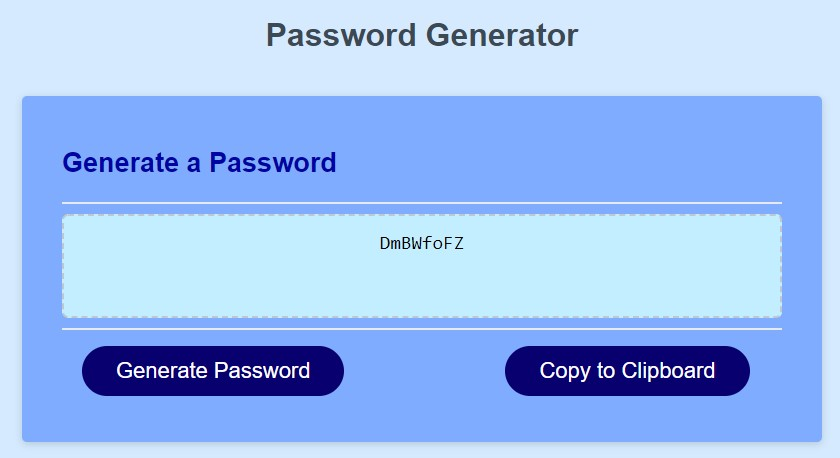

# Password Generator Project

## Objective: Create a password generator that allow the user to select options such as using symbols or numbers to generate a password of a user specified character limit. 

Planned features:
- Prompt user for the number of characters to use for password.
- Provide validation that a value of at least 8 and no more than 128 was entered.
- Add validation for blanks and letters.
- Prompt users if they want to use lower case letters.
- Prompt user if they want to use upper case letters.
- Prompt user if they want to use numbers.
- prompt user if they want to use special characters.
- Provide validation that at least one of the above options was selected.

EXTRA: Added a **Copy to Clipboard** button as it did not apear that you could select and copy the password manually.

Deployed site: https://crimsondrac1.github.io/PassGen/

